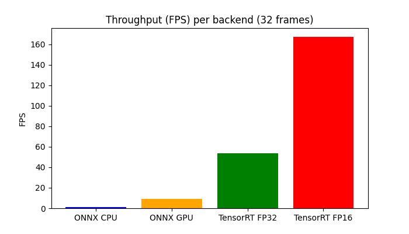
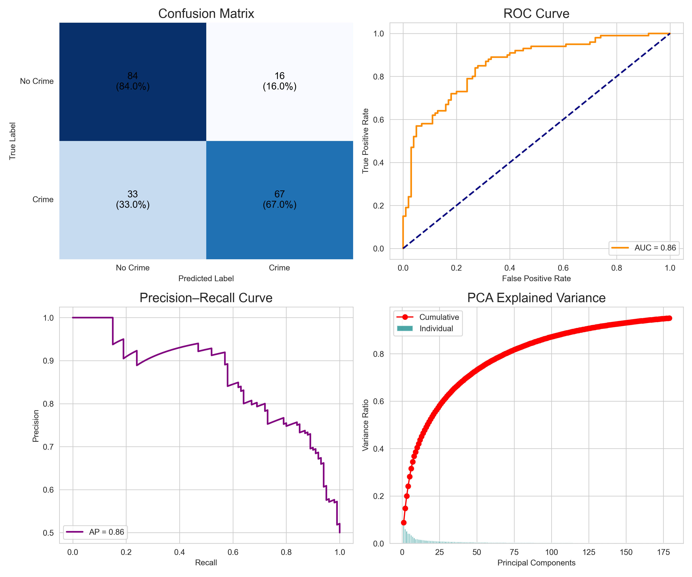

</head>
<body>
  <h1>Aegis‑X Crime Detector</h1>
  
<strong>Accuracy:</strong> 76% — Trained on UCF Crime dataset.

  
Real‑time crime detection pipeline using ONNX MC3 (3D convolution) for feature extraction, PCA + SVM for classification, with TensorRT FP16/FP32 engines for optimized inference. Sends Telegram alerts on detection.

  <h2>Logo</h2>
  

  <h2>Demo GIF</h2>
  
  <video controls src="assets/last gif.mp4" title="Title"></video>

  <h2>Features</h2>
  <ul>
    <li>Feature extraction with ONNX MC3 (3D conv).</li>
    <li>Classification with PCA + SVM (saved in <code>best_crime_detector.joblib</code>).</li>
    <li>Inference optimized with TensorRT FP16 and FP32 engines.</li>
    <li>Telegram integration for alerts (image, label, confidence).</li>
    <li>Benchmark plots and per‑class accuracy visuals included.</li>
    <li>Development journal documenting errors and fixes.</li>
  </ul>

  <h2>Benchmarks</h2>
  

  <h2>Accuracy visuals</h2>
  

  <h2>Quick Start</h2>
  <h3>Install dependencies</h3>
  <pre><code>pip install -r requirements.txt</code></pre>
  
(Requires: torch, onnxruntime, opencv-python, numpy, scikit-learn, joblib, pycuda, nvidia-tensorrt)

  <h3>Run example</h3>
  <pre><code>python detector/fp16_32.py --video path/to/video.mp4 --engine fp16
python detector/onnx_runner.py --video path/to/video.mp4</code></pre>
  
<strong>Note:</strong> Ignore <code>mc3_infer.py</code> and <code>trying_models.py</code>. They are for understanding/debugging only.

 

  

 
</body>
</html>
